# diagen

**Netlist in, clean schematic out.** An automatic layout engine for analog and
digital circuit diagrams, built so an AI (or a person) can describe *what is
connected* and get a publication-ready TikZ or SVG drawing without adjusting
coordinates by hand.

```
title Common-emitter amplifier
input vin
output vout
C1 cap vin b 10u
R1 res vcc b 47k
R2 res b 0 10k
Q1 npn c=c b=b e=e
RC res vcc c 4.7k
RE res e 0 1k
CE cap e 0 100u
C2 cap c vout 10u
```

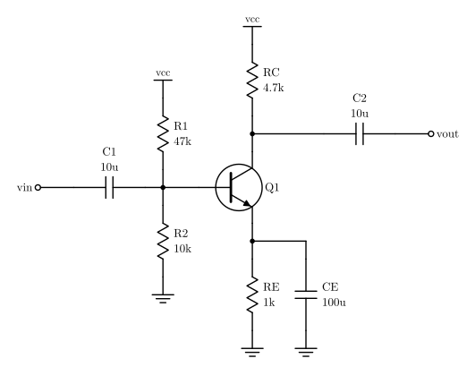

The bias divider is stacked, RC and RE sit in line with the transistor, the
bypass capacitor sits beside RE, and the rails are drawn as symbols. None of
that is written in the netlist: the engine infers it.

> **中文簡介**：diagen 是一個電路圖自動佈局引擎。你（或 AI）只要用網表描述「哪些元件接在哪些節點」，它就會自動擺放元件、拉線，輸出不需再手動微調的 TikZ 與 SVG，類比電路（放大器、濾波器、電晶體偏壓）和數位電路（邏輯閘、正反器、方塊圖）都適用。附有 MCP 伺服器與 Claude Code 技能，讓 AI 可以直接畫圖並看預覽自我檢查。語法請見 [diagen/NETLIST.md](diagen/NETLIST.md)。

## Use

```bash
python3 -m diagen examples/ce_amp.cir -o ce_amp.svg -o ce_amp.tex
```

```bash
python3 -m diagen examples/ce_amp.cir -o ce_amp.tex --standalone
```

Outputs are picked by extension: `.svg`, `.tex` (a `tikzpicture` that needs
only `\usepackage{tikz}`, no circuitikz), and `.png` (preview, via macOS Quick
Look). The report printed on stderr says `OK` or `INCOMPLETE` and lists wire
length, bends, crossings, junctions, and warnings such as dangling nets. The
exit code is 0 only when every net routed.

No dependencies: Python 3.10+ standard library only. `pip install -e .`
adds the `diagen` and `diagen-mcp` commands.

### For AI agents

* **MCP server**: `python3 -m diagen.mcp_server`. It is registered for this
  folder in `.mcp.json`; elsewhere run
  `claude mcp add diagen -- python3 -m diagen.mcp_server`. The
  `render_circuit` tool returns the report, the TikZ, and a PNG preview, so
  the model can check its own drawing. `netlist_reference` returns the
  language reference.
* **Claude Code skill**: `.claude/skills/circuit-diagram/SKILL.md` teaches the
  workflow (write netlist → render → read report and preview → fix netlist).
* **Language reference**: [diagen/NETLIST.md](diagen/NETLIST.md).

## How it works

1. **Parse** ([netlist.py](diagen/netlist.py)): a SPICE-like text format or
   JSON. Nets named `0`/`gnd` and `vcc`/`vdd`/`+5V` are *rails*: they are
   drawn as local symbols, never wired. This removes most of the long wires
   that make hand-drawn schematics messy.
2. **Orient and group** ([layout.py](diagen/layout.py)): parts between a
   signal and a rail hang vertically; parts between two signals lie in the
   signal path. Parts that belong together become one layout node: feedback
   around an op-amp or gate (with a non-inverting amplifier's gain resistor
   hanging straight down from the feedback junction), parallel parts,
   dividers, and loads stacked on a transistor's collector, emitter, drain or
   source.
   **Transistor cells**: transistors joined through their vertical pins are
   stacked in line (an inverter's pull-up over its pull-down, a cascode, a
   push-pull pair). Two stacks with the same parts that share a net, or
   are cross-coupled, are drawn side by side: as copies facing the same way
   when they are in parallel (the pull-ups of a NAND gate), otherwise as
   mirror images (a differential pair, a current mirror, an SRAM cell, an
   H-bridge), each level turning its base or gate inwards when that net is
   shared or cross-coupled and outwards when it comes from outside. The part
   that closes the pair (the tail source, the NAND pull-down) sits on the
   axis, a load between the two halves lies across the middle, and a
   transistor hanging off the junction inside each half (the access
   transistors of an SRAM cell) lies on its side next to it, gate up. A
   complementary pair with its gates tied (an inverter, a push-pull stage) is
   mirrored top to bottom: its input comes in level with the output, on the
   axis between the two. An input that only feeds a base facing right comes
   in from the right.
3. **Rank by signal flow**: a Sugiyama-style layered layout. Edges come from
   driver pins (gate/op-amp outputs, input ports), or for passive nets from
   BFS distance from the sources. Cycles are broken by DFS, cross-coupled
   latches share a column, and the ranks are assigned by longest path. A gate
   that only drives outputs joins the column of the gates reading the same
   inputs (the four ANDs of a decoder line up).
   **Stages**: groups of parts that repeat in a chain, each linked to the next
   by a single net (the carry of a ripple adder), are found automatically, or
   tagged with `stage=N`. Each stage is laid out on its own and the stages
   follow one another as blocks, every one in the same column order; the
   search moves them together, so they stay alike.
4. **Order and align**: barycentre sweeps reduce crossings. A second
   candidate order adds Sugiyama crossing reduction on top: wires that span
   columns get virtual points in the columns they pass, and neighbours are
   transposed while that removes crossings. Then each column
   picks y positions by weighted median over connected pins, solved exactly
   with isotonic regression (pool-adjacent-violators). Nodes never overlap
   and wires come out straight wherever possible.
5. **Route** ([router.py](diagen/router.py)): grid A* over (point, heading)
   with bend and crossing costs; the heuristic counts the bends a route
   cannot avoid, which keeps the search narrow. Nets are routed as trees with T-junction
   dots. Hard rules: never through a body or label, never along another net,
   cross only at right angles, never turn or join on another net's wire. Nets
   that fail are retried in a different order; anything still unroutable is
   drawn as a red dashed air wire and reported.
6. **Search**: neighbouring parts in each column are swapped one pair at a
   time and the circuit is re-routed; a swap is kept whenever the routed
   drawing scores better (wire length, bends, crossings, area). The search
   runs from several starting layouts, since a local search ends up somewhere
   quite different depending on where it starts: both column orders, and
   with `ports=auto` both port placements (with `near`, ports get thin
   columns of their own beside the part they connect to, and one stage's
   outputs never share a column with the next stage's inputs). Each start
   gets a share of the budget, and the rest goes to the best one. For commutative gates (AND/OR/XOR…) the search also tries
   exchanging inputs, which is often what removes a crossing. Op-amps may
   be mirrored ('+' and '-' swap, and the feedback part moves to the other
   side): which side reads best depends on the neighbours, such as the two
   input amplifiers of an instrumentation amp. A part with `flip=` in the
   netlist keeps its orientation.
   If a net cannot be routed, the channels are widened and it tries again.
   The search budget is a number of trials, not seconds, so a netlist gives
   the same drawing on every machine.
   With `routing=bus`, a net that feeds several gates of one column becomes
   a vertical trunk just left of that column: its sources (select inputs and
   their inverters) sit above the gates and feed the trunk tops in a
   staircase, and each gate input taps the trunk with a dot. The router lays
   the trunks down first and connects the pins to them.
7. **Render** ([render.py](diagen/render.py)): one primitive list, two back
   ends, so the SVG and the TikZ always match.

## Gallery

| | |
|---|---|
| 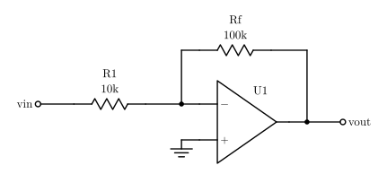 | 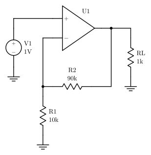 |
| 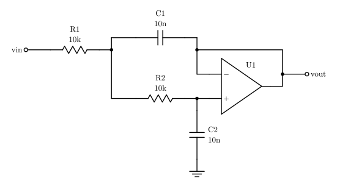 | 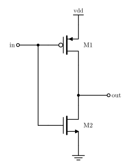 |
| 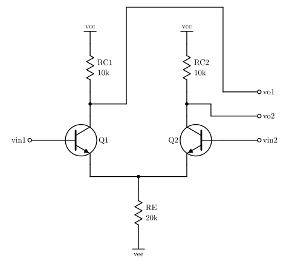 | 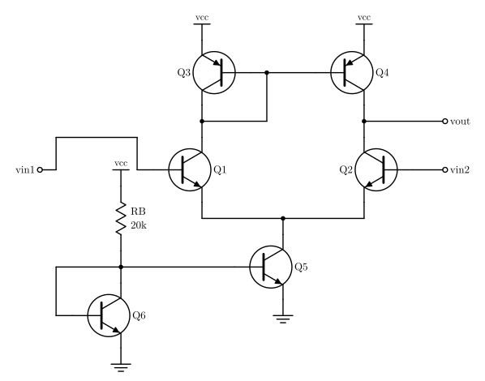 |
| 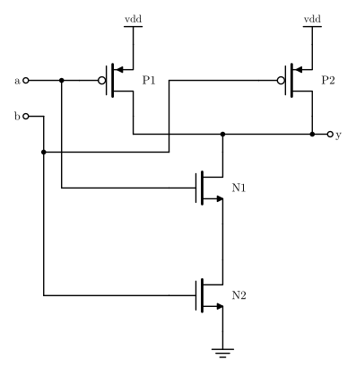 | 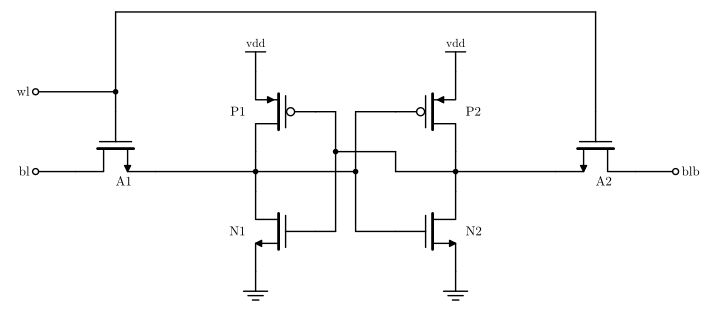 |
| 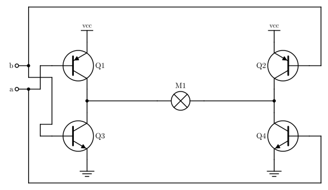 | 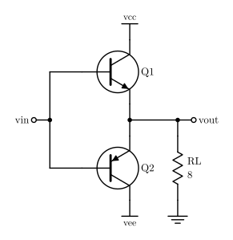 |
| 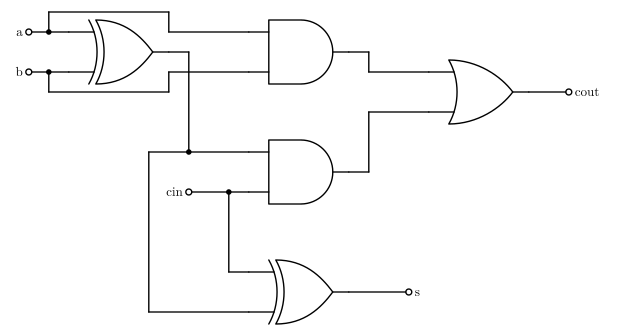 | 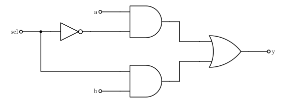 |
| 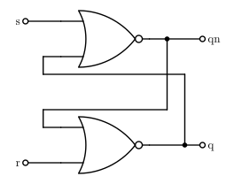 | 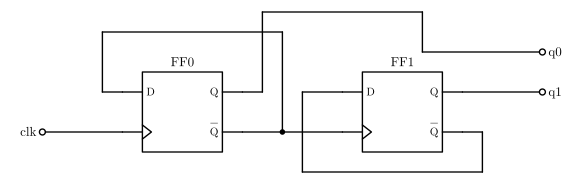 |
| 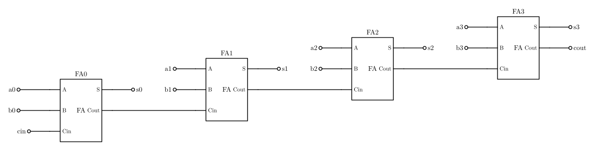 | 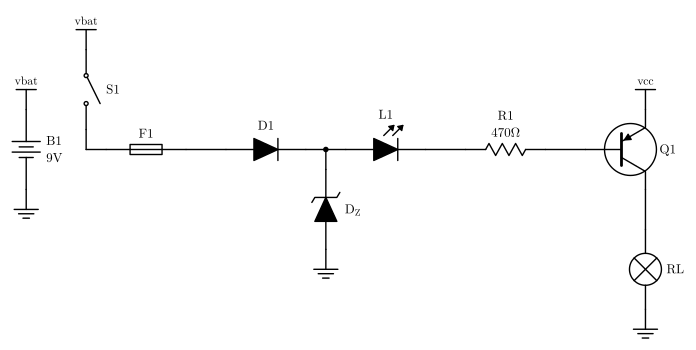 |
| 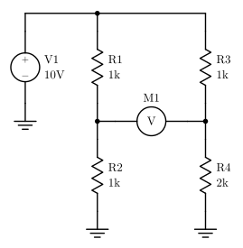 | 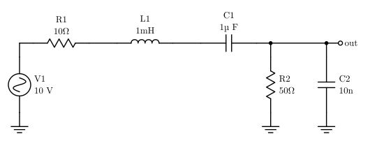 |
| 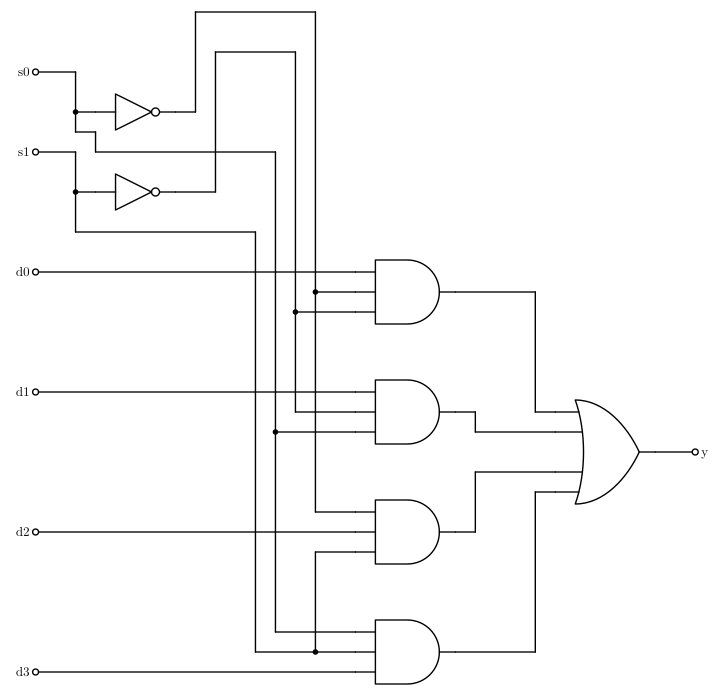 | 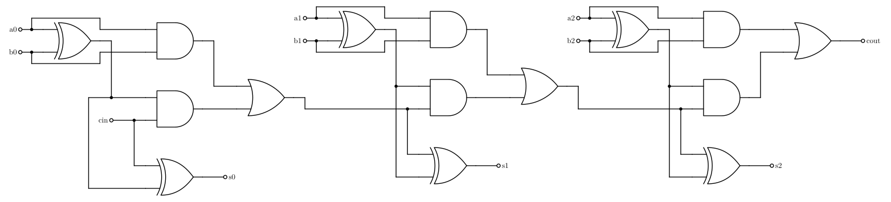 |

## Extending

* **A new symbol**: add a builder in [symbols.py](diagen/symbols.py) that
  returns a `SymbolDef`: artwork primitives, pins on integer grid points with
  their exit direction and `in`/`out` kind, and a body rectangle. Then map
  its type names in `lookup()`.
* **A new layout rule**: most visual conventions are grouping rules in
  `Layout._group`.

## Tests

```bash
python3 -m unittest discover tests
```

The suite routes every example, checks the layout rules, and renders 60
random netlists to make sure nothing crashes.

## License

GPL-3.0-or-later. See [LICENSE](LICENSE).
